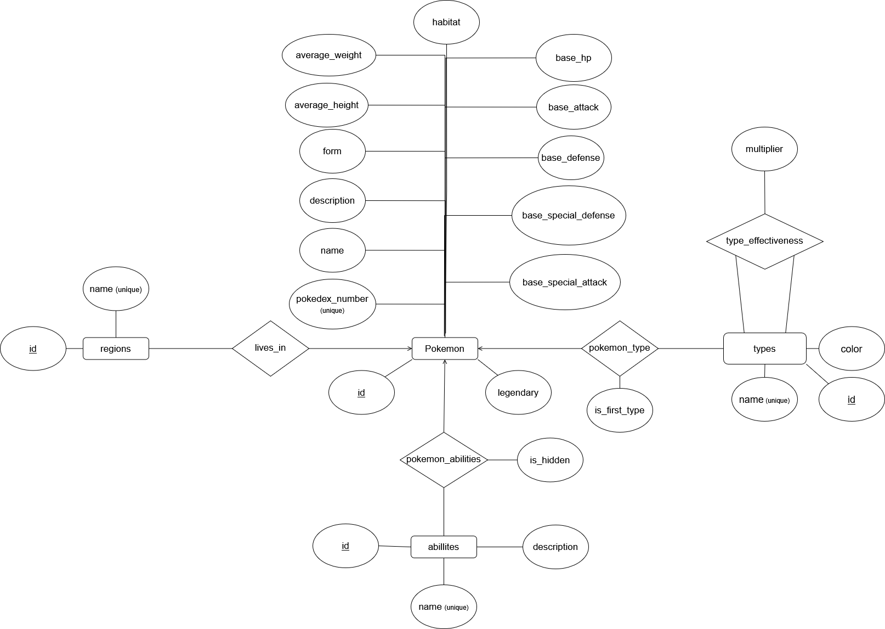

# Pokedex Web Application


# E/R Diagram



# Build steps

Firstly, create a python virtual environment:
```bash
python -m venv .venv
```

On Windows, perform the following commands to enter the virtual environment:
```bash
Set-ExecutionPolicy Unrestricted -Scope Process
.venv\Scripts\activate
```

On Linux / MacOS, simply perform:
```bash
source .venv/bin/activate
```

Install the required packages:
```bash
pip install -r requirements.txt
```

First initialize the database:
```bash
python database.py
```

Then run the application:
```bash
flask run
```

Alternatively, run the application in debug mode. This also initializes the database:
```bash
python app.py
```

# Possible interactions

The front page shows a grid of pokemons. Click on one of the pokemon to see it in detail.

Various attributes related to the pokemon is shown. One may delete a pokemon from the same page.

To add a pokemon, press `Add Pokemon`. One needs to fill in a new unique pokedex number, name,
and first type. Other fields are optional. The name is checked using a regex, allowing only unicode letters and hyphens.

Currently, there is no support for uploading images.

Once a pokemon is added, it may be removed again.